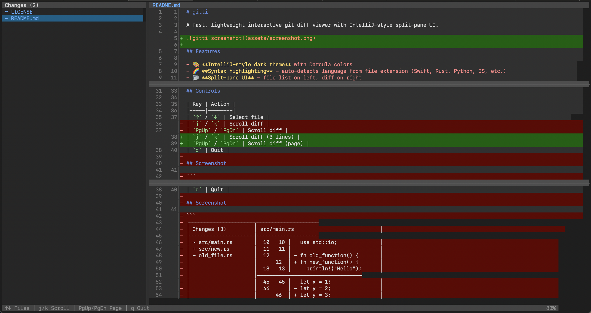
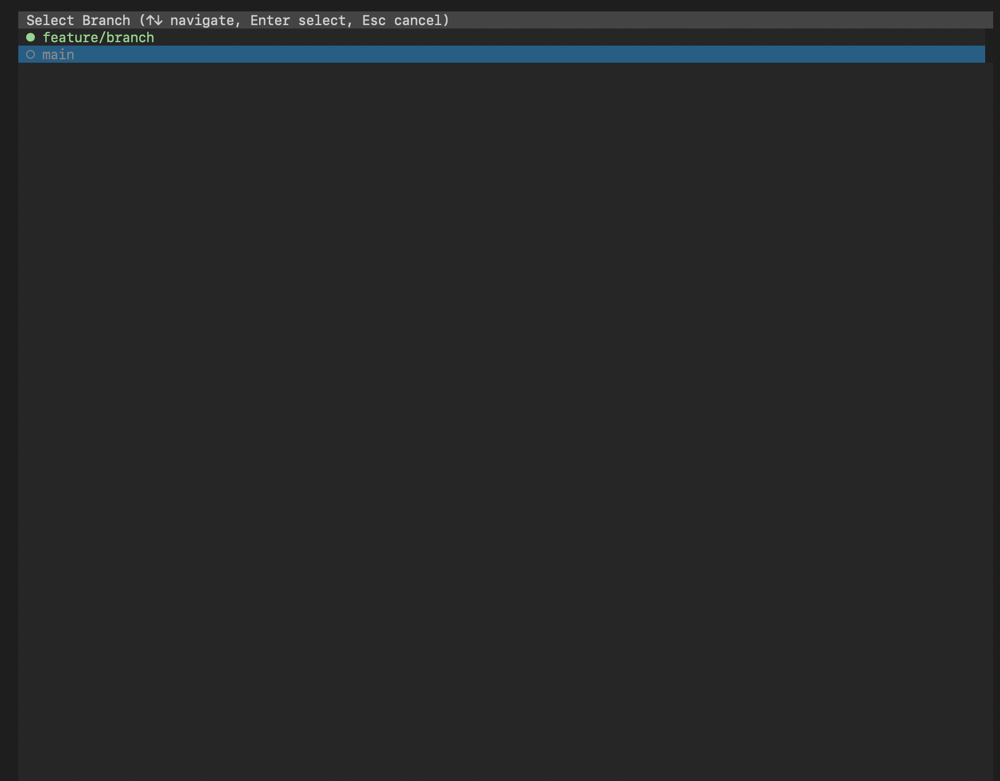

# gitti

A fast, lightweight interactive git diff viewer with split-pane UI.





## Features

- 🎨 **Dark theme** with Darcula colors
- 🌈 **Syntax highlighting** - auto-detects language from file extension (Swift, Rust, Python, JS, etc.)
- 📂 **Split-pane UI** - file list on left, diff on right
- 🌿 **Branch browsing** - view history from any branch
- 🖱️ **Mouse support** - click files, scroll with wheel
- 🔄 **Live reload** - automatically updates when files change
- ⌨️ **Keyboard navigation** - select files with arrow keys
- 📊 **Smart hunks** - shows only changed lines + context
- ⚡ **Fast** - uses libgit2 directly, no subprocess
- 🔧 **Lightweight** - minimal dependencies

## Installation

```bash
cargo build --release
cargo install --path .
```

## Usage

```bash
gitti                    # Show unstaged changes
gitti --staged           # Show staged changes  
gitti -c HEAD~1          # Compare with commit
gitti -C 10              # 10 lines of context (default: 5)
```

## Controls

| Key | Action |
|-----|--------|
| `b` | Select branch |
| `←` / `→` | Select commit |
| `↑` / `↓` | Select file |
| `j` / `k` | Scroll diff (3 lines) |
| `PgUp` / `PgDn` | Scroll diff (page) |
| `m` | Toggle mouse/select mode |
| `q` | Quit |

## License

MIT - see [LICENSE](LICENSE) file.
